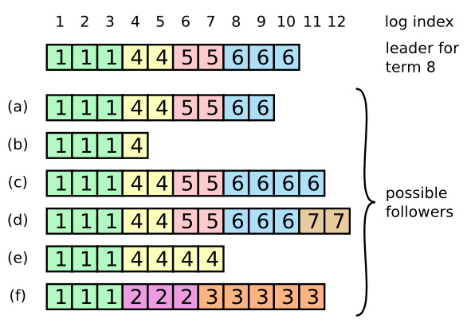

# 我眼中的raft一致算法

## 一、基本概念

我选择从节点系统对于值如何达成一致的角度出发，对raft一致算法进行理解和解释。还有一种角度是从对复制日志的管理达成一致性出发（即认为Raft 是一种为了管理复制日志的一致性算法）。

Raft 是一种用于实现分布式共识的算法或协议。而分布式共识是指：假设有一个单节点系统，其中将节点视为一个存储单个值的数据库服务器，同时还存在一个客户端可以发送值到服务器，当只有单个节点时，节点上就那个值达成一致或共识很容易，但如果有多个节点，如何达成共识就是分布式共识所要解决的问题。

raft算法的工作过程可以概括如下：在节点系统中，一个节点可以处于 3 种状态中的1种：The Follower state（跟随状态）、the Candidate state,（候选状态）t和he Leader state（领导人状态）。所有的节点最初都处于跟随状态，如果追随者没有听到领导人的声音，他们就可能成为候选人。候选人随后向其他节点请求投票。其他节点在收到投票请求后将进行回复和投票。候选人如果获得多数节点的投票，则成为领导人。这个过程称为**领导人选举**。

领导人选举成功之后，所有对系统的更改现在都需要通过领导人，每次更改都会作为一条记录添加到节点的日志中。当日志条目未提交时，不会更新节点的值，而要提交条目，领导人节点首先要将其复制到跟随者节点，在大多数节点已经写入条目之后，条目就立即提交到领导人节点，领导人随后通知追随者，条目已提交。集群现已就系统状态达成共识。此过程称为**日志复制**。

除此之外Raft 在任何时候都会保证下表1中的各个特性。

**表1.1  Raft包含的特性**  ：

| 特性             | 解释                                                         |
| :--------------- | :----------------------------------------------------------- |
| 选举安全特性     | 对于一个给定的任期号，最多只会有一个领导人被选举出来         |
| 领导人只附加原则 | 领导人绝对不会删除或者覆盖自己的日志，只会增加               |
| 日志匹配原则     | 如果两个日志在某一相同索引位置日志条目的任期号相同，那么我们就认为这两个日志从头到该索引位置之间的内容完全一致 |
| 领导人完全特性   | 如果某个日志条目在某个任期号中已经被提交，那么这个条目必然出现在更大任期号的所有领导人中 |
| 状态机安全特性   | 如果某一服务器已将给定索引位置的日志条目应用至其状态机中，则其他任何服务器在该索引位置不会应用不同的日志条目 |

## 二、领导人选举

### 2.1 选举触发

Raft 使用一种心跳机制来触发领导人选举。在初始状态，所有服务器节点都是跟随者身份。一个服务器节点只要他从领导人或者候选人处接收到有效的RPCs（即远程过程调用）就继续保持着跟随者状态。领导人周期性的向所有跟随者发送心跳包（即不包含日志项内容的附加条目（AppendEntries） RPCs）来维持自己的权威。如果一个跟随者在一段时间里没有接收到任何消息，也就是**选举超时**（一般随机设置为 150ms 到 300ms 之间），那么他就会认为系统中没有可用的领导人,并且发起选举以选出新的领导人。

### 2.2 选举过程

在选举超时后，跟随者先要增加自己的当前任期号并且转换到候选人状态。然后他会并行地向集群中的其他服务器节点发送请求投票的RPCs（远程过程调用）来给自己投票。对于候选人而言，选举会产生三种结果，即：(a) 他自己赢得了这次的选举成为领导人，(b) 其他的服务器节点成为领导人，(c) 一段时间之后没有领导人产生。

(a)**候选人赢得选举**：当一个候选人从整个集群的大多数服务器节点获得了针对同一个任期号的选票，那么他就赢得了这次选举并成为领导人。每一个服务器节点最多会对一个任期号投出一张选票，按照先来先服务的原则（即对收到的第一个投票申请进行回复和投票）。要求大多数选票才能赢得选举的规则确保最多只会有一个候选人赢得此次选举。一旦候选人赢得选举，他就立即成为领导人。然后他会向其他的服务器发送心跳消息来建立自己的权威并且阻止发起新的选举。

(b) **其他的服务器节点成为领导人**：在等待投票的时候，候选人可能会从其他的服务器接收到声明它是领导人的附加条目（AppendEntries）RPC。如果这个领导人的任期号（包含在此次的 RPC中）不小于候选人当前的任期号，那么候选人会承认领导人合法并回到跟随者状态。 如果此次 RPC 中的任期号比自己小，那么候选人就会拒绝这次的 RPC 并且继续保持候选人状态。

(c) **没有领导人产生：**第三种可能的结果是候选人既没有赢得选举也没有输，如果有多个跟随者同时成为候选人，那么选票可能会被瓜分以至于没有候选人可以赢得大多数人的支持。当这种情况发生的时候，每一个候选人都会超时，然后通过增加当前任期号来开始一轮新的选举。然而，没有其他机制的话，选票可能会被无限的重复瓜分。

Raft 算法使用随机选举超时时间的方法来确保很少会发生选票瓜分的情况，就算发生也能很快的解决。为了阻止选票起初就被瓜分，所有服务器节点的选举超时时间是从一个固定的区间（例如 150-300 毫秒）随机选择，即大部分服务器节点的选举超时时间不同。这样可以把服务器都分散开以至于在大多数情况下只有一个服务器会选举超时；然后他赢得选举并在其他服务器超时之前发送心跳包。同样的机制被用在选票瓜分的情况下。每一个候选人在开始一次选举的时候会重置一个随机的选举超时时间，然后在超时时间内等待投票的结果；这样减少了在新的选举中另外的选票瓜分的可能性。

## 三、日志复制 

### 3.1 概述

在领导人被选举出来后，他就开始为客户端提供服务。客户端的每一个请求都包含一条被复制状态机执行的指令。领导人把这条指令作为一条新的日志条目附加到日志中去，然后并行地发起附加条目 RPCs 给其他的服务器，让他们复制这条日志条目。当这条日志条目被安全地复制，领导人会应用这条日志条目到它的状态机中然后把执行的结果返回给客户端。如果跟随者崩溃或者运行缓慢，再或者网络丢包，领导人会不断的重复尝试附加日志条目 RPCs （尽管已经回复了客户端）直到所有的跟随者都最终存储了所有的日志条目。

### 3.2 日志组成及提交条件

日志由有序序号标记的条目组成，而每个日志条目都存储一条状态机指令和从领导人收到这条指令时的任期号。日志中的任期号用来检查是否出现不一致的情况。每一条日志条目同时也都有一个整数索引值来表明它在日志中的位置。一个条目当可以安全地被应用到状态机中去的时候，就认为是可以提交了。

领导人来决定什么时候把日志条目应用到状态机中是安全的；这种日志条目被称为**已提交**。Raft 算法保证所有已提交的日志条目都是持久化的并且最终会被所有可用的状态机执行。在领导人将创建的日志条目复制到大多数的服务器上的时候，日志条目就会被提交。同时，领导人的日志中之前的所有日志条目也都会被提交，包括由其他领导人创建的条目。后续内容将会提及某些当在领导人改变之后应用这条规则的隐晦内容，同时展示这种提交的定义是安全的。领导人跟踪了最大的将会被提交的日志项的索引，并且索引值会被包含在未来的所有附加日志 RPCs （包括心跳包），这样其他的服务器才能最终知道领导人的提交位置。一旦跟随者知道一条日志条目已经被提交，那么他也会将这个日志条目应用到本地的状态机中（按照日志的顺序）。

### 3.3 日志中的特性

Raft 的日志机制被设计用来维护不同服务器日志之间的高层次的一致性。这么做不仅简化了系统的行为也使其更具有可预测性，同时它也是安全性保证的一个重要组件。Raft 维护着以下的特性，这些特性共同组成了表1中的**日志匹配特性（Log Matching Property）**：

- 如果在不同的日志中的两个条目拥有相同的索引和任期号，那么他们存储了相同的指令。
- 如果在不同的日志中的两个条目拥有相同的索引和任期号，那么他们之前的所有日志条目也全部相同。

第一个特性来自这样的一个事实，领导人最多在一个任期里在指定的一个日志索引位置创建一条日志条目，同时日志条目在日志中的位置也从来不会改变。第二个特性由附加日志 RPC 的一个简单的**一致性检查**所保证。在发送附加日志 RPC 的时候，领导人会把新的日志条目前紧挨着的条目的索引位置和任期号包含在日志内。如果跟随者在它的日志中找不到包含相同索引位置和任期号的条目，那么他就会拒绝接收新的日志条目。一致性检查就像一个归纳步骤：一开始空的日志状态肯定是满足日志匹配特性的，然后一致性检查在日志扩展的时候保护了日志匹配特性。因此，每当附加日志 RPC 返回成功时，领导人就知道跟随者的日志一定是和自己相同的了。

### 3.4 日志不一致问题

在正常的操作中，领导人和跟随者的日志保持一致性，所以附加日志 RPC 的一致性检查从来不会失败。然而，领导人崩溃的情况会使得日志处于不一致的状态（老的领导人可能还没有完全复制所有的日志条目）。这种不一致问题会在领导人和跟随者的一系列崩溃下加剧。图 3.1 展示了跟随者的日志可能和新的领导人不同。跟随者可能会丢失一些在新的领导人中存在的日志条目，他也可能拥有一些领导人没有的日志条目，或者两者都发生。丢失或者多出日志条目可能会持续多个任期。

> **图3.1**：当一个领导人成功当选时，跟随者可能是任何情况（a-f）。每一个盒子表示是一个日志条目；里面的数字表示任期号。跟随者可能会缺少一些日志条目（a-b），可能会有一些未被提交的日志条目（c-d），或者两种情况都存在（e-f）。例如，场景 f 可能会这样发生，某服务器在任期 2 的时候是领导人，已附加了一些日志条目到自己的日志中，但在提交之前就崩溃了；很快这个机器就被重启了，在任期 3 重新被选为领导人，并且又增加了一些日志条目到自己的日志中；在任期 2 和任期 3 的日志被提交之前，这个服务器又宕机了，并且在接下来的几个任期里一直处于宕机状态。

### 3.5 保持一致性的方法

在 Raft 算法中，领导人是通过强制跟随者直接复制自己的日志来处理不一致问题的。这意味着在跟随者中的冲突的日志条目会被领导人的日志覆盖。后续将会提及如何通过增加一些限制来使得这样的操作是安全的。

要使得跟随者的日志进入和自己一致的状态，领导人必须找到最后两者达成一致的地方，然后删除跟随者从那个点之后的所有日志条目，并发送自己在那个点之后的日志给跟随者。所有的这些操作都在进行附加日志 RPCs 的一致性检查时完成。领导人针对每一个跟随者维护了一个 **nextIndex**，这表示下一个需要发送给跟随者的日志条目的索引地址。当一个领导人刚获得权力的时候，他初始化所有的 nextIndex 值为自己的最后一条日志的 index 加 1。如果一个跟随者的日志和领导人不一致，那么在下一次的附加日志 RPC 时的一致性检查就会失败。在被跟随者拒绝之后，领导人就会减小 nextIndex 值并进行重试。最终 nextIndex 会在某个位置使得领导人和跟随者的日志达成一致。当这种情况发生，附加日志 RPC 就会成功，这时就会把跟随者冲突的日志条目全部删除并且加上领导人的日志。一旦附加日志 RPC 成功，那么跟随者的日志就会和领导人保持一致，并且在接下来的任期里一直继续保持。

> **nextIndex**:是指对于每一台服务器，发送到该服务器的下一个日志条目的索引。初始值为领导人最后的日志条目的索引+1。

通过这种机制，领导人在获得权力的时候就不需要任何特殊的操作来恢复一致性。他只需要进行正常的操作，然后日志就能在回复附加日志 RPC 的一致性检查失败的时候自动趋于一致。领导人从来不会覆盖或者删除自己的日志（表1.1 的领导人只附加特性）。

日志复制机制展示出了一致性特性：Raft 能够接受，复制并应用新的日志条目只要大部分的机器是工作的；在通常的情况下，新的日志条目可以在一次 RPC 中被复制给集群中的大多数机器；并且单个的缓慢的跟随者不会影响整体的性能。
